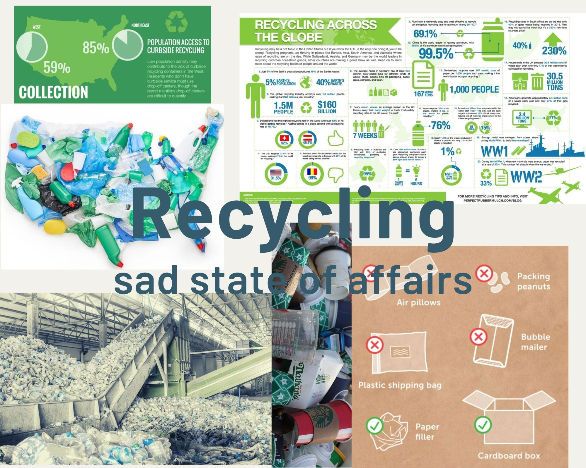

# Final Project, Part II #

See Part I [here](https://dsmorris412.github.io/Morris-portfolio/Final_Project_Morris_I)

See Part III [here](https://dsmorris412.github.io/Morris-portfolio/Final_Project_Part_III)

## Story board ##

## Mood Board ##

## Data visualizations ##

<a href="https://infogram.com/08179543-3184-46e9-aa1e-83c4cf1b2961" style="color:#989898!important;text-decoration:none!important;" target="_blank">Untitled infographic</a> <a href="https://infogram.com" style="color:#989898!important;text-decoration:none!important;" target="_blank" rel="nofollow">Infogram</a>

<a href="https://infogram.com/ad28c510-e1e3-4edf-ac63-2417b319a14b" style="color:#989898!important;text-decoration:none!important;" target="_blank">Timeline Dark Infographic</a> <a href="https://infogram.com" style="color:#989898!important;text-decoration:none!important;" target="_blank" rel="nofollow">Infogram</a>

## User Research ##

For my user research, I provided fairly minimal context. I did mention that it was important that this develop into a story in its final stage...and that my story component hadn't evolved from my story board to visualization progression just yet. My target audience for the content is broad - practically anyone that recycles, so I stood to greatly benefit from these four recyclers! And, because I wanted meaningful feedback, I did target individuals I knew would be insightful and thoughtful with their comments (but 2 of 3 were different from my user research earlier in the course!).

Prior to sharing my mood board, wireframes and storyboard, I knew it was fragmented in its current state and I expected some confusion and uncertainty. Nevertheless, there are certainly patterns in the feedback, and it provided a great deal of subject matter that I can work on.

Encouragingly, the 'main takeaways' from my reviewers were mostly consistent both with each other and with my general intention - that recycling is flawed and often misunderstood by the general public. Once further developing my project, I do want that main takeaway to include the call to action.

I think the majority of my visualizations need tweaking - more descriptive titles, clearer units, etc. At this stage, I don't think most of my visualizations 'speak-for-themselves' which I would like to make more evident moving into the final project - keeping in mind that 60 seconds will not be sufficient to provide a level of context to any one visualization. It's clear that right now, there are not logical connectors between existing visualizations - I need to continue building the visualizations to follow the progression I've presented in my story board. Relative to that, the story will be much more prevalent if I can figure out how to implement the 'Kathy' character adjacent to the visualizations (I have looked into many different avenues without any luck so far!). 

